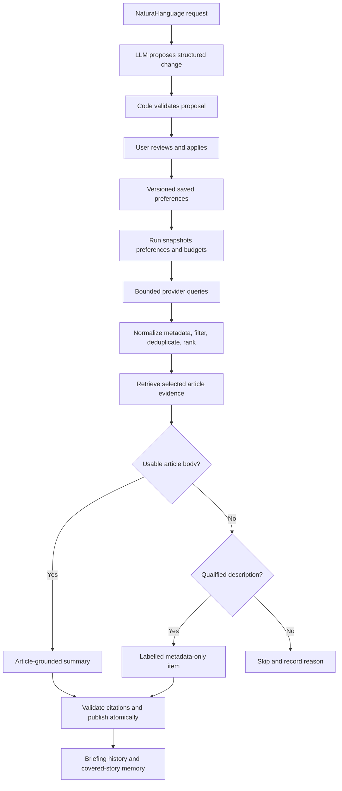

# Preferences, discovery, evidence, and stored memory

Last updated: 2026-09-19. This is the pipeline implementation reference and
the project's sole actionable improvement backlog. **Current** means implemented
code; **planned** means the agreed design; **proposed default** means a
reviewable choice not yet shipped. Every open follow-up has one ID in the
Improvement backlog table; other documents link to those IDs instead of
maintaining a separate TODO list.

## 1. Implementation status

| Area                                          | Current status                                                                                                                                                      |
| --------------------------------------------- | ------------------------------------------------------------------------------------------------------------------------------------------------------------------- |
| Natural-language topic proposals              | Llama 3.3 70B proposal/review/Apply flow implemented; one live end-to-end smoke path passed                                                                         |
| SQLite preferences and proposals              | Durable Object SQLite preferences and pending/applied/discarded proposal records                                                                                    |
| Briefing publication and run status           | Manual Workflow reserve/collect/compose/publish flow; normal same-origin run-status API with terminal failure reasons                                               |
| Run-scoped collection and evidence            | Configured SearXNG plus Google News/GDELT bounded collection, temporary evidence, exact URL dedupe, and contained provider failures                                 |
| Google News RSS and GDELT discovery           | Worker providers with fixture tests; the decoded Google News RSS channel runs alongside SearXNG in normal runs; GDELT returns 429 and stays on the non-SearXNG path |
| SearXNG                                       | Private Cloudflare Container configuration, local container, bounded Worker provider, and responsive inspection screen                                              |
| Publisher evidence                            | Bounded Worker HTML extraction and separate local paragraph experiment                                                                                              |
| Description/snippet preservation and fallback | SearXNG provenance and inspection qualification implemented; composition planned                                                                                    |
| Ranking, grouping, briefing generation, chat  | Ranking/grouping, manual generation, and durable source-scoped chat sessions implemented; evidence refresh remains planned                                          |

The feasibility endpoint returns diagnostics, not briefings. Preferences, topic
proposals, and immutable published briefing payloads are persisted. While a
briefing run is active, its candidate metadata, extraction output, and partial
collection failures are persisted temporarily for composition or retry; the
candidate evidence is removed on publication or run failure. Stories and
article bodies are never copied into a published briefing, and conversations
are not implemented.
Manual generation creates a Workflow using the Agent-reserved run UUID. The
Today screen polls its normal run-status API until it reaches a terminal state.
Terminal failures retain a bounded workflow/composition message and the
attributable collection failures; temporary candidate evidence is deleted.
SearXNG's container cache and ignored secret are infrastructure, not app memory.

## 2. End-to-end design



Code owns validation, budgets, fetching, URLs, dates, scheduling, exact
duplicates, storage, retries, and publication. The LLM interprets intent,
proposes search concepts, assesses semantic relevance, groups related stories,
compares developments, and writes grounded summaries. Model judgment cannot
override exclusions, evidence limits, or the preference Apply requirement.

## 3. Natural-language parsing — planned

### Topic-first configuration

Users add topics independently from the Topics screen rather than having to
write one prompt describing the whole daily briefing. Each topic has a stable
ID, name, enabled state, interests/exclusions, source preferences, summary
overrides, and its own search concepts. Global settings hold the daily
schedule, overall reading budget, and inherited summary defaults.

Adding a topic appends it; editing or pausing a topic changes only that topic.
Existing topics and global settings remain intact. A run snapshots all enabled
topics and combines their eligible stories into one briefing, applying a
single overall reading budget rather than granting each topic five minutes.
Cross-topic duplicate stories become one item with multiple topic references.

Build this incrementally: first explicit topic fields and add/edit/pause/delete
controls with persistence; then natural-language interpretation for individual
topics, using the same proposal/Apply flow. Natural-language changes to global
settings are a separate scope. A single all-in-one prompt may be an optional
later convenience, but is not the required configuration path. A topic prompt
that requests global changes must surface those separately, not silently apply
them outside the selected topic.

### Example topic input

> Follow AI model releases and practical developer tools, not stock prices or
> celebrity opinions. Prefer official releases. Use short technical bullets
> explaining what happened and why it matters.

This creates or edits only the AI topic. World news and Liverpool are separate
topics added independently. The five-minute reading budget and 08:00
Asia/Kolkata schedule come from global settings. The topic description is a
preference request, not a literal search query.

### Interpretation, validation, and Apply

1. Validate the request size and operation at the API edge. Load the current
   preference revision and explicit scope: add topic, edit a specific topic,
   or edit global settings.
2. Give the model the request, current topic (including `userWording`), current
   settings, supported fields, and output schema. Require a complete proposed
   topic whose non-empty narrative consolidates prior intent with the new
   request, an explanation, and unresolved questions. Reject an unchanged
   narrative for a non-empty edit request. Do not run searches or write SQL from
   model output.
3. Validate the output with Zod and deterministic semantic checks: schedule,
   IANA timezone, lengths, topic IDs, provider IDs, source URLs, and bounded
   search concepts. Schema validation checks shape, not interpretation quality.
4. Show a before/after proposal. Missing fields mean unchanged; clearing a
   field must be explicit. Unrelated topics must not silently reset.
5. Ambiguity remains unapplied until clarified or edited. “Skip Liverpool
   today” requires distinguishing a run override from a saved exclusion.
6. Apply only on explicit user action. Check the proposal's base revision,
   reject stale updates, save atomically, and increment the preference revision.

“Make it shorter” should propose reading-length changes. A question about a
story must not mutate preferences. A rejected proposal changes nothing.

### Logical preference shape

Illustrative JSON, not an implemented schema:

```json
{
  "revision": 1,
  "schedule": { "localTime": "08:00", "timezone": "Asia/Kolkata" },
  "reading": { "targetMinutes": 5, "targetStories": { "min": 8, "max": 10 } },
  "summary": {
    "format": "bullets",
    "depth": "concise",
    "audience": "general",
    "emphasis": ["what happened", "why it matters"]
  },
  "exclusions": [],
  "sources": { "preferred": [], "blocked": [], "officialFirst": false },
  "topics": [
    {
      "id": "ai",
      "name": "Artificial intelligence",
      "enabled": true,
      "interests": ["model releases", "developer tools"],
      "exclusions": ["stock-price coverage", "celebrity opinions"],
      "sourceOverrides": { "officialFirst": true },
      "summaryOverrides": { "audience": "technical" },
      "searchConcepts": [
        { "terms": ["AI model", "release"], "intent": "new models" },
        { "terms": ["AI developer tools"], "intent": "practical tools" }
      ]
    }
  ]
}
```

The example abbreviates world-news and Liverpool topics; production proposals
need complete validated concepts for each active topic. Story count is a
target, not a quota. Effective summary settings merge global values with
explicit topic overrides; absent topic fields inherit global values.

Store relevant user wording alongside structured settings so requests such as
“focus on operational impact” survive a coarse style enum. Style instructions
control presentation but cannot authorize unsupported detail. “Detailed
technical analysis” must remain limited when only a description is available.

### Search concepts versus provider queries

The model proposes provider-neutral entities, aliases, required phrases,
exclusions, source preferences, language, and freshness. Code compiles these
into provider-specific requests and checks capabilities. A literal query does
not have identical semantics across providers.

For example, “Liverpool FC” plus football context disambiguates the city.
Store the applied search plan with its preference revision and record actual
queries per run. Reapply exclusions after discovery because provider filters
can be incomplete. Query counts, ranking weights, lookback, and failover order
still need evaluation rather than being fixed by this document.

## 4. What will be stored

The Agent owns Durable Object SQLite and explicit versioned migrations; the
Workflow owns generation steps. These are logical records, not a requirement
for a separate SQL table for every row.

| Record              | Stored fields                                                                                                                                      | Purpose and retention                                                     |
| ------------------- | -------------------------------------------------------------------------------------------------------------------------------------------------- | ------------------------------------------------------------------------- |
| Preferences         | Revision, global/topic settings, applied wording, search plan, updated time                                                                        | Editable persistent configuration                                         |
| Proposal            | Original request, base revision, validated patch, explanation, status, parser/model version                                                        | Review/apply audit; proposal retention still to decide                    |
| Conversation        | Message ID, role, text, timestamp, story/briefing references, citations                                                                            | Keep until deleted; do not store hidden model reasoning                   |
| Run                 | ID, trigger, preference snapshot/revision, queries, errors, timestamps, status, usage                                                              | Reproducibility and cost accounting; diagnostic retention still to decide |
| Source metadata     | Headline, original discovery URL, resolved publisher URL, source, topic, provider/engine/query attribution, dates/provenance, optional description | Lightweight source records referenced by saved items                      |
| Briefing            | Date, run ID, completeness, preference revision, ordered items, summaries, citations, evidence tiers, limitations                                  | Keep until deleted                                                        |
| Covered story       | Group ID, source URLs, last-covered time, previous factual development, evidence tier, fingerprint                                                 | Suppress repeats; expire after 90 days                                    |
| Evidence provenance | Retrieval time, final URL, extraction version, status/reason, truncation, evidence reference/hash                                                  | Audit summary support; a hash alone does not preserve evidence            |
| Temporary evidence  | Bounded extracted text, run association, expiry                                                                                                    | Retries/composition; exact TTL and cleanup mechanism still to decide      |
| Retained evidence   | Item ID, source URL, publisher, evidence tier, retrieval time, bounded extracted text (≤12,000 characters), truncation flag                        | Grounded follow-ups; deleted with its briefing                            |

Do not permanently save publisher HTML or full article copies. Save composed
summaries, lightweight attributed descriptions, and — by explicit decision on
2026-09-20 — one bounded extracted text per cited source in a side table read
only by the chat turn. That retention is the deliberate exception: it is capped
at the extraction limit, kept with its retrieval time and tier, and absent for
earlier briefings. Revisit it if chat moves to on-demand retrieval, which would
let the stored copies be dropped.

Runs need immutable preference snapshots and stable publication IDs. A unique
publication constraint must prevent duplicates after Workflow retries.
Workflow step results may retain temporary evidence; understand their platform
retention before claiming immediate deletion.

Deletion removes owned briefings/conversations and unreferenced source records.
Do not delete a source still referenced by another briefing. Memory deletion
and preference reset need explicit UI controls. Proposal and diagnostic
retention are open decisions rather than silently indefinite storage.

## 5. Discovery parsing

### Current normalized contract

`src/server/discovery/types.ts` currently contains:

| Field          | Meaning                                                              |
| -------------- | -------------------------------------------------------------------- |
| `id`           | Provider-normalized URL used for exact deduplication                 |
| `title`        | Provider headline                                                    |
| `publisher`    | Google RSS source label or GDELT destination hostname                |
| `publishedAt`  | Parsed Google RSS date; null for GDELT                               |
| `sourceUrl`    | Google redirect link or GDELT publisher link                         |
| `discoveryUrl` | Original discovery link when `sourceUrl` is a resolved publisher URL |
| `discovery`    | `google-news` or `gdelt`                                             |

SearXNG additionally preserves optional `description` (text, kind, provider,
observation time), `engines`, and `dateProvenance`. Shared runtime schemas live
in `src/shared/inspection.ts`; discovery reexports the types. Search responses
also retain query, observation time, and selected time range. The provider enum
includes `searxng`; its source URL is a direct publisher lead and publication
date is parsed search metadata or null. Google/GDELT contracts remain compatible.
A run uses every configured discovery channel. `providerCalls` always includes
Google News RSS, adds the private SearXNG channel when one is configured, and
keeps GDELT only when SearXNG is absent, because live GDELT requests are still
rate-limited. `briefing-workflow.ts` always configures SearXNG (local
`SEARXNG_BASE_URL` or the private Container), so a normal generate-briefing run
queries SearXNG and the decoded Google News RSS channel together, and each
Google query receives its own share of the run's decode budget instead of the
first query consuming all of it.

The optional `discoveryUrl` preserves the original discovery link once
collection resolves a publisher URL, and deduplication uses the resolved URL.
There is no language or semantic group ID on candidates yet; evidence returns
its own final article URL. Exact URL deduplication does not group independent
coverage of the same event.

### Google News RSS — current

`discovery/google-news.ts` validates query length (2–200), locale/country
syntax, and result cap (1–25). It fetches RSS with a 10-second timeout and
streamed 750 KB bound. A regex parser reads title, link, source, and pubDate,
removes CDATA, and decodes a small set of XML entities. Only HTTPS Google News
links survive; `oc` and fragments are removed. Valid dates become ISO strings,
invalid dates become null. It deduplicates URLs and caps results.

It does not preserve `<description>`. A Google description may merely repeat
the title, link, and source; that does not qualify as an informative fallback.
Regex XML parsing and partial entity decoding are feasibility limitations.

Collection resolves a Google RSS item to its publisher before deduplication.
`discovery/google-news-decoder.ts` fetches the Google article page, reads its
`data-n-a-sg` signature and `data-n-a-ts` timestamp, posts them to the
undocumented `batchexecute` endpoint, and validates the returned external URL.
Each decode costs two requests with a 1 MB page bound, no retries, and no
CAPTCHA workarounds; one run-wide `maxGoogleNewsDecodes` budget (default 4,
ceiling 60) is divided evenly across the scheduled Google queries so no single
topic spends it. The decode step spends that allowance only on leads the date
gate can still accept: a lead whose RSS date is stale or in the future is kept
for the diagnostic trace as `date-ineligible` and is never fetched, and the
remaining leads are attempted newest-first, with undated leads last. A lead
without a publisher link keeps its Google link in the retained trace and is
never sent to evidence; the outcome separates `decode-failed` (an attempt
returned nothing: challenge, invalid envelope, HTTP failure) from
`decode-budget` (the run's allowance never reached that lead). A decoded lead
keeps its Google link as `discoveryUrl`.

Because this channel does not share SearXNG's engines, it still returns leads
when SearXNG reports `google news: CAPTCHA`. Measured on 2026-09-20, six SearXNG
queries each returned eight candidates but every query was `partial`, while six
Google News RSS queries returned eight each and were `ok`; four decode attempts
produced four publisher-linked leads, three of which reached the collected set.
No Google-side quota has been observed at measured volumes: 310 sequential
article-page requests completed with every response HTTP 200, no `Retry-After`,
and no challenge, so the run's byte cost is set by the decode budget and the
≈582 KB page — not by a documented limit. The protocol is undocumented and can
change, rate-limit, or challenge automated requests without notice; it also
rejects a request whose envelope does not match exactly as a bodiless HTTP 400,
and a page that outgrows the byte bound fails closed as an unresolved lead. See
[link verification](discovery-link-verification.md).

### GDELT — current

`discovery/gdelt.ts` validates query length/result cap, appends an English
filter, and requests JSON article-list results for the past week sorted by
index date. It enforces a 10-second timeout and streamed 750 KB bound. It
requires JSON and an article array, then validates each record with Zod.
Nonempty titles, English records, and HTTP(S) links without credentials
survive. It removes fragments, deduplicates URLs, and derives publisher from
the hostname.

GDELT `seendate` is indexing time, not publication time; `publishedAt` stays
null. The adapter preserves no description. When one is absent, there is no
description fallback to create. Recent isolated live requests returned 429
despite long intervals; five-second spacing does not guarantee acceptance.

### SearXNG — current Worker integration

The Worker validates JSON results, sanitizes titles/snippets, rejects invalid
URLs, deduplicates exact URLs while merging engines, and preserves engine
failures. It uses news category, English, a 15-second timeout, streamed 750 KB
bound, and at most 15 candidates. Missing/invalid search dates initially stay
null. The local UI explicitly requests evidence; briefing collection also uses
the bounded retrieval path described below.

The instance runs bing news, duckduckgo news, and reuters. SearXNG's `google
news` and `brave.news` engines are disabled — the Google engine is
CAPTCHA-suspended and Brave's news results carry no publication dates — and the
`brave` web engine stays defined but disabled because the news engine shares its
network configuration. Measured on 2026-09-20, disabling them cut SearXNG engine
failures in a three-topic collection from 14 to 4 and left two of seven queries
`ok`, at the cost of dated coverage: Bing and DuckDuckGo returned mostly undated
results. See [measured results](../infra/searxng/README.md).

Optional time filters are passed to engines and also enforced in the Worker
against returned dates. The Worker window is the requested range plus a
one-day buffer — day → 2 days, month → 32 days, year → 366 days — because
engine timestamps are rounded to the day and can lag the publisher. An empty
engine-error list does not prove relevance or freshness.

### Planned metadata additions

Preserve the original discovery link separately from the resolved publisher
URL — implemented as `discoveryUrl` for decoded Google leads. Still planned: an
optional description object with bounded sanitized text, kind
(`publisher-feed`, `search-snippet`, or `publisher-metadata`), source URL,
provider/engine, and observation time. Do not replace missing descriptions with
model-generated text.

Keep indexed/discovered times distinct from publication time. Add language,
date provenance, provider/query attribution, and a many-to-one mapping into
semantic groups. URL normalization must preserve article-identifying query
parameters. Grouped sources keep their own citations; do not merge snippets
into a fictional single article.

## 6. Evidence parsing and limitations

### Current Worker

`src/server/evidence.ts` fetches direct publisher links independently of provider
after URL checks. Collection resolves Google RSS links before retrieval, so
evidence normally receives a publisher URL; a Google link that still reaches this
module from local inspection or feasibility requires a publisher redirect, and
another Google link returns unavailable. Publisher fetching follows at most five
redirects, validates each destination, and has a 10-second timeout.

Require successful HTML, stream-limit HTML to 500 KB, prefer an article block
or substantial paragraphs within main/document, sanitize entities/tags, reject
recognized challenge titles, and require 400 text characters. Return
at most 12,000 characters, final URL, truncation, and `publisher-page`
provenance, or an unavailable reason.

Body-read errors return unavailable. Results include page title and extraction
method. Literal private/reserved IPv4, IPv6, credentials, and local hostnames
are rejected; DNS-aware host policy remains pending. This is local-only inspection.

`usable` currently means a mechanical text threshold passed. It does not prove
article-body quality, completeness, trustworthiness, freshness, or support for
every follow-up. Navigation and consent text may pass the same threshold.

### Publisher-date recovery

Before rejecting an otherwise eligible undated discovery lead, collection may
spend a bounded evidence request to recover its publication date. The default
reserves at most six requests, shared with the existing twelve-request evidence
budget and allocated round-robin across topics. A retrieval is never repeated:
if the page supplies a fresh date, its evidence result is reused for the
candidate.

Accepted dates have explicit provenance: `publisher-jsonld` for structured
`datePublished`, `publisher-meta` for recognized HTML metadata, or
`publisher-time` for a semantic `time[datetime]` element. JSON-LD is preferred,
then metadata, then `time`. A recovered date still passes the same fixed-run
two-day, future-date, source-block, and exclusion checks. URL paths, retrieval
time, snippets, and model guesses never establish freshness.

The 2026-09-19 retrospective examined all 25 undated URLs from run
`58e7d94c-7075-4632-afb8-e7f050a943ea` without changing stored briefing data.
Seventeen pages exposed a date (16 JSON-LD, one `time`); five would have been
fresh at the original run time. Three of those five met the current readable
evidence threshold, though one was off-topic and one was a live timeline page
that needs stronger article-type validation. Seven pages were unavailable (four
over the 500 KB limit, two Reuters 401 responses, one AP 403); one page had no
date. This establishes feasibility, not a relevance or publisher-quality
guarantee.

`npm run evaluate:briefing-run -- <run-id>` reads retained local run metadata
and prints query, candidate-outcome, recovered-date, engine-outcome, and final
inclusion measurements without reading article text. Omit the run ID to inspect
the newest local run. Set `BRIEFING_STATE_DB` only when the local Durable Object
database lives outside Wrangler's default state directory.

### Standalone local script

`verify-searxng-evidence.mjs` uses a separate paragraph heuristic: prefer an
`<article>` block, otherwise scan substantial `<p>` text and print a sample for
manual review. It has streamed size bounds, bounded redirects, and a 15-second
article timeout. Its successful experiment is not proof of an implemented
extraction quality across publishers. The Worker now uses a similar bounded
heuristic, with its own fixture tests.

### Planned stronger quality gate

Separate retrieval status from evidence tier. Check final URL, headline/body
agreement, article-like paragraphs, language, dates when available, boilerplate,
challenge pages, and truncation. Use a tested readable-body extractor rather
than blanket tag stripping.

Later rendering is a bounded replaceable evidence adapter, not an unlimited
browser crawler or a paywall bypass. HTTP 200 without article content remains
unavailable. External content is untrusted data: embedded instructions must
never change preferences, request secrets, or trigger unrelated tools.

## 7. Description-only fallback — planned policy

When stronger article evidence cannot be obtained within budget and there are
not enough stronger relevant stories, use a qualified concise description as a
clearly attributed limited item. Inspection implements tier qualification:
at least 80 characters, 12 words, and three distinct words beyond the title,
with common navigation/consent text rejected. This heuristic is not proof of
relevance or factual support. Briefing selection, exclusions, freshness policy,
fallback caps, and composition remain planned.

| Tier          | Material                                                                       | Allowed output                                                                |
| ------------- | ------------------------------------------------------------------------------ | ----------------------------------------------------------------------------- |
| Article       | Publisher body passes quality gate                                             | Grounded summary within supported detail                                      |
| Description   | Informative feed description, publisher metadata, or attributed search snippet | Short item explicitly labelled with origin and article limitation             |
| Headline only | Title, URL, source/date only                                                   | Optional discovery link outside the substantive briefing; no expanded summary |
| Unavailable   | Invalid links or no meaningful supporting material                             | Skip and record reason                                                        |

Search excerpts can be stale, truncated, or assembled from page fragments.
They have weaker provenance than publisher-authored descriptions. Keep their
origin visible; never present snippets as article text.

### Qualification and selection

1. Enforce relevance, exclusions, blocked sources, language, and freshness
   before fallback. Do not add weak stories to hit a target count.
2. Prefer stronger evidence within the same story group. Accessible coverage
   of the same event can replace a blocked article while keeping attribution.
3. Try bounded alternative candidates/providers before fallback. Do not let
   blocked pages monopolize the run or retry indefinitely.
4. Require informative description text beyond a repeated headline, publisher
   name, navigation, or HTML links. Sanitize and preserve its provenance.
5. Reject known-old descriptions for today's news. Unknown publication time
   stays unknown; eligibility for undated descriptions needs review.
6. Compose only what the description supports and cite its original source
   link. Prefer a resolved publisher link; a Google redirect can remain an
   explicitly identified discovery link. A publisher homepage is not an
   article citation.
7. Validate evidence tier, citation integrity, exclusions, and fallback count.
   Provider collection failures and item evidence limitations are separate
   dimensions; display both when applicable.

**Proposed initial tunables:** enable description fallback; allow up to two
items in a target 8–10 story briefing; limit each to one or two short sentences.
These values are not stored settings yet. Do not pad weak sections. If all
qualified items are metadata-only, present an explicitly limited update list
rather than claiming a normal full briefing.

### Example

Illustrative description: “Example Lab announced Model Q, adding a larger
context window. The release includes updated documentation.”

Allowed item: “Example Lab announced Model Q with a larger context window and
updated docs. **Description only — article text unavailable.** [Source]”

Do not add an exact context size, benchmarks, pricing, recommendations, or
deployment implications without evidence. A request for deep analysis does
not expand what a description supports.

### Chat and duplicate memory

Chat sessions validate an owned briefing run and a selected story ID before
they are created. Each durable session stores the briefing run/date and story
identity; each durable turn belongs to exactly one session. The Agent validates
the stored session before assembling context. A turn supplies the item's saved
summary, stored change note, code-owned citations, and the retained bounded
extract of each cited source, labelled by source and retrieval time; it has no
broad search or arbitrary URL tool. The UI renders those citations independently
of model output. The prompt states that the extract may be incomplete and the
live page may differ, and requires the model to say what is missing rather than
claim it read the full article.

Bounded publisher evidence refresh is a planned extension of this narrow
context seam. If added, it may retrieve only an existing citation and must
return an explicit unavailable outcome rather than silently using model
knowledge. Freshly retrieved content carries its own timestamp and citations
and may differ from the original briefing's source version.

Store metadata-only coverage in duplicate memory. A newly accessible article
with unchanged facts is not itself a substantial update. Resurface only a
supported factual development and explain what changed. Headline wording,
search rank, or snippet observation date is not enough. Sparse descriptions
may not support a reliable substantial-update comparison.

## 8. Failure, grounding, and cost controls

Use structured failure codes. A mixed run can have articles, description
fallbacks, and provider failures; publish those limits clearly. If no qualified
current items remain, preserve the previous dated briefing and record the
failed run. Never relabel old cached results as today's briefing.

Every stage needs request, byte, retry, model-input/output, and total-run
budgets. Respect provider throttling with bounded backoff and failover. Record
provider calls, model usage, and evidence/fallback counts before promising
monthly costs.

Validate model citations against supplied evidence IDs and reject unsupported
sources or detail. Schema checks do not prove factual grounding. Deterministic
interface tests and a separate live quality evaluation must both cover it.

## 9. Improvement backlog

Date-filter follow-up: daily SearXNG collection queries configured news engines
without `time_range` and then applies a rolling two-day, publication-metadata
check before retrieval. This preserves DuckDuckGo and Brave discovery when
Bing is unavailable; only engines that return `publishedDate` can pass the
freshness gate. Unknown, future, and stale dates remain ineligible. DISC-03
remains partial because search metadata is not publisher verification;
DISC-06 remains partial until per-engine coverage and returned dates are
measured for the deployed instance.

Update this table with each related increment. Close items only against their
acceptance criteria. Priorities suggest sequencing; proceed one reviewed
increment at a time. Historical design sections above explain why an item
exists; they do not create additional work outside this table.

| ID        | Priority             | Status          | Work                                                           | Acceptance criteria                                                                                                                                                                                                                                                                                                                                                                                                                                                                                                                                                                                                                                                                                                                                                                                                                                                                                                                                                                                                                                                                                                                                                                                                                                                                                                                                                                                                                                                                                                                                                                                                                                                                                                                                                                                                                                                                                                                                                                                                                                                                                                                                                                                                                                                                                                                                                                                                                                                                                                                                                                                                                                                                                                                                                                                                                                                                                                                                                                                                                                                                                                               |
| --------- | -------------------- | --------------- | -------------------------------------------------------------- | --------------------------------------------------------------------------------------------------------------------------------------------------------------------------------------------------------------------------------------------------------------------------------------------------------------------------------------------------------------------------------------------------------------------------------------------------------------------------------------------------------------------------------------------------------------------------------------------------------------------------------------------------------------------------------------------------------------------------------------------------------------------------------------------------------------------------------------------------------------------------------------------------------------------------------------------------------------------------------------------------------------------------------------------------------------------------------------------------------------------------------------------------------------------------------------------------------------------------------------------------------------------------------------------------------------------------------------------------------------------------------------------------------------------------------------------------------------------------------------------------------------------------------------------------------------------------------------------------------------------------------------------------------------------------------------------------------------------------------------------------------------------------------------------------------------------------------------------------------------------------------------------------------------------------------------------------------------------------------------------------------------------------------------------------------------------------------------------------------------------------------------------------------------------------------------------------------------------------------------------------------------------------------------------------------------------------------------------------------------------------------------------------------------------------------------------------------------------------------------------------------------------------------------------------------------------------------------------------------------------------------------------------------------------------------------------------------------------------------------------------------------------------------------------------------------------------------------------------------------------------------------------------------------------------------------------------------------------------------------------------------------------------------------------------------------------------------------------------------------------------------- |
| PREF-01   | Preference phase     | Awaiting review | Validated schema and proposal/Apply flow                       | Ambiguity stays unapplied; unrelated fields preserved; stale revisions rejected; rejection changes nothing                                                                                                                                                                                                                                                                                                                                                                                                                                                                                                                                                                                                                                                                                                                                                                                                                                                                                                                                                                                                                                                                                                                                                                                                                                                                                                                                                                                                                                                                                                                                                                                                                                                                                                                                                                                                                                                                                                                                                                                                                                                                                                                                                                                                                                                                                                                                                                                                                                                                                                                                                                                                                                                                                                                                                                                                                                                                                                                                                                                                                        |
| PREF-03   | Before topic prompts | Completed       | Independent persisted topic add/edit/pause/delete              | Add preserves existing topics; edit affects selected topic only; paused topics excluded from future run snapshots; one global reading budget                                                                                                                                                                                                                                                                                                                                                                                                                                                                                                                                                                                                                                                                                                                                                                                                                                                                                                                                                                                                                                                                                                                                                                                                                                                                                                                                                                                                                                                                                                                                                                                                                                                                                                                                                                                                                                                                                                                                                                                                                                                                                                                                                                                                                                                                                                                                                                                                                                                                                                                                                                                                                                                                                                                                                                                                                                                                                                                                                                                      |
| PREF-02   | Preference phase     | Completed       | SQLite migrations and persistence                              | Reload/restart preserve preferences, schedule/timezone, and topic overrides                                                                                                                                                                                                                                                                                                                                                                                                                                                                                                                                                                                                                                                                                                                                                                                                                                                                                                                                                                                                                                                                                                                                                                                                                                                                                                                                                                                                                                                                                                                                                                                                                                                                                                                                                                                                                                                                                                                                                                                                                                                                                                                                                                                                                                                                                                                                                                                                                                                                                                                                                                                                                                                                                                                                                                                                                                                                                                                                                                                                                                                       |
| DISC-01   | High                 | Completed       | SearXNG Worker provider                                        | Separate file; normalized links and attributed snippets; partial engine errors; local Worker integration passes                                                                                                                                                                                                                                                                                                                                                                                                                                                                                                                                                                                                                                                                                                                                                                                                                                                                                                                                                                                                                                                                                                                                                                                                                                                                                                                                                                                                                                                                                                                                                                                                                                                                                                                                                                                                                                                                                                                                                                                                                                                                                                                                                                                                                                                                                                                                                                                                                                                                                                                                                                                                                                                                                                                                                                                                                                                                                                                                                                                                                   |
| DISC-02   | High                 | Partial         | Description/provenance fields                                  | Informative snippets preserved; headline-only RSS descriptions rejected; absent stays absent                                                                                                                                                                                                                                                                                                                                                                                                                                                                                                                                                                                                                                                                                                                                                                                                                                                                                                                                                                                                                                                                                                                                                                                                                                                                                                                                                                                                                                                                                                                                                                                                                                                                                                                                                                                                                                                                                                                                                                                                                                                                                                                                                                                                                                                                                                                                                                                                                                                                                                                                                                                                                                                                                                                                                                                                                                                                                                                                                                                                                                      |
| DISC-03   | High                 | Partial         | Freshness and query quality                                    | Search and recovered publisher dates retain provenance; stale/future/undated leads are rejected; the briefing window is an inclusive two days (one-day target plus the shared one-day buffer), so a story published late the previous day stays eligible                                                                                                                                                                                                                                                                                                                                                                                                                                                                                                                                                                                                                                                                                                                                                                                                                                                                                                                                                                                                                                                                                                                                                                                                                                                                                                                                                                                                                                                                                                                                                                                                                                                                                                                                                                                                                                                                                                                                                                                                                                                                                                                                                                                                                                                                                                                                                                                                                                                                                                                                                                                                                                                                                                                                                                                                                                                                          |
| DISC-04   | Medium               | Partial         | Throttling and provider failover                               | Provider exceptions become partial failures; 429 cannot monopolize a run; concurrent calls respect budget; failures are retained                                                                                                                                                                                                                                                                                                                                                                                                                                                                                                                                                                                                                                                                                                                                                                                                                                                                                                                                                                                                                                                                                                                                                                                                                                                                                                                                                                                                                                                                                                                                                                                                                                                                                                                                                                                                                                                                                                                                                                                                                                                                                                                                                                                                                                                                                                                                                                                                                                                                                                                                                                                                                                                                                                                                                                                                                                                                                                                                                                                                  |
| DISC-05   | Medium               | Planned         | Robust RSS/entity parsing                                      | CDATA, numeric entities, malformed XML, and empty feeds handled explicitly                                                                                                                                                                                                                                                                                                                                                                                                                                                                                                                                                                                                                                                                                                                                                                                                                                                                                                                                                                                                                                                                                                                                                                                                                                                                                                                                                                                                                                                                                                                                                                                                                                                                                                                                                                                                                                                                                                                                                                                                                                                                                                                                                                                                                                                                                                                                                                                                                                                                                                                                                                                                                                                                                                                                                                                                                                                                                                                                                                                                                                                        |
| DISC-06   | Deferred             | Partial         | Provider-side date filters                                     | Inspection sends SearXNG `time_range`; daily collection deliberately does not until per-engine coverage is measured; the instance now runs bing news, duckduckgo news, and reuters only, whose returned-date coverage is unmeasured                                                                                                                                                                                                                                                                                                                                                                                                                                                                                                                                                                                                                                                                                                                                                                                                                                                                                                                                                                                                                                                                                                                                                                                                                                                                                                                                                                                                                                                                                                                                                                                                                                                                                                                                                                                                                                                                                                                                                                                                                                                                                                                                                                                                                                                                                                                                                                                                                                                                                                                                                                                                                                                                                                                                                                                                                                                                                               |
| DISC-07   | High                 | Completed       | Fair collection scheduler                                      | Round-robin topic/channel passes, per-query decode shares, and evidence allocation stay within shared budgets; configured SearXNG runs first; exhausted capacity is disclosed                                                                                                                                                                                                                                                                                                                                                                                                                                                                                                                                                                                                                                                                                                                                                                                                                                                                                                                                                                                                                                                                                                                                                                                                                                                                                                                                                                                                                                                                                                                                                                                                                                                                                                                                                                                                                                                                                                                                                                                                                                                                                                                                                                                                                                                                                                                                                                                                                                                                                                                                                                                                                                                                                                                                                                                                                                                                                                                                                     |
| DISC-08   | Conditional          | Completed       | Google News RSS publisher-link decoder                         | Decoder bounded and reachable: the decoded Google News channel runs alongside a configured SearXNG instance, resolved leads keep the Google link as `discoveryUrl`, and unresolved leads stay visible as `decode-failed` (failed attempt) or `decode-budget` (never attempted)                                                                                                                                                                                                                                                                                                                                                                                                                                                                                                                                                                                                                                                                                                                                                                                                                                                                                                                                                                                                                                                                                                                                                                                                                                                                                                                                                                                                                                                                                                                                                                                                                                                                                                                                                                                                                                                                                                                                                                                                                                                                                                                                                                                                                                                                                                                                                                                                                                                                                                                                                                                                                                                                                                                                                                                                                                                    |
| DISC-09   | High                 | Partial         | Decode budget and freshness-first decoding                     | Freshness-first decoding implemented: stale/future leads are never fetched and eligible leads are attempted newest-first. Remaining: measure yield before raising the default budget                                                                                                                                                                                                                                                                                                                                                                                                                                                                                                                                                                                                                                                                                                                                                                                                                                                                                                                                                                                                                                                                                                                                                                                                                                                                                                                                                                                                                                                                                                                                                                                                                                                                                                                                                                                                                                                                                                                                                                                                                                                                                                                                                                                                                                                                                                                                                                                                                                                                                                                                                                                                                                                                                                                                                                                                                                                                                                                                              |
| DISC-10   | High                 | Decision needed | Hosted provider throttling from Workers egress                 | Measured from a probe Worker on 2026-09-21: the Google News decoder's `batchexecute` POST answered HTTP 429 on every attempt, with and without a browser user agent, while the RSS feed itself answered 200 and its interstitial page carries no publisher URL (canonical and og:url both point at news.google.com), so publisher links cannot be resolved from Workers at all; GDELT answered 429 for two of three queries even spaced six seconds apart, though a single earlier query returned 20 dated articles with direct publisher URLs. The first hosted run therefore reached composition with zero eligible candidates and published nothing, retaining the prior edition as designed. A container would not give a distinct source IP — Cloudflare documents no dedicated egress for Containers or Workers outside the enterprise Smart Shield and Zero Trust add-ons — but SearXNG returns direct publisher URLs so the decoder is bypassed entirely; engine reachability from Cloudflare's range was measured on 2026-09-21: DuckDuckGo's HTML endpoint answered 200 with publisher links, Mojeek answered 200 with result links, Bing and Startpage answered 200 without extractable result links, and Google answered 429, so a containerised SearXNG configured for DuckDuckGo and Mojeek and excluding Google is the promising path, although the owner reports that SearXNG's Google engine reaches a captcha after a while, which is the same wall. Measured on the same day as the captcha-free alternative: publisher RSS answered 200 with direct publisher links and dates (BBC World 27 items, Guardian World 45, Sky Sports Premier League 20), the Hacker News Algolia API answered 200 with direct publisher URLs, Reddit's JSON endpoint answered 403, and article retrieval from the edge returned full text (BBC and Guardian articles at 600-1,041 words of paragraph text, Sky Sports news at 932), so discovery and evidence both work from Workers without scraping a search engine. SearXNG was then put back in service locally with Google News and Brave excluded: the kept engines were `bing news`, `duckduckgo news`, and `reuters`, and adding the general `duckduckgo` engine was needed because the news category alone left football at zero results. Measured after restarting the instance: Liverpool FC Premier League 40 results with 40 dates (duckduckgo news 20, reuters 20, was 0 before), artificial intelligence 42 with 32 dates (bing news 10, duckduckgo news 12, reuters 20), and a new Semiconductor industry topic returned 8 results per query. `bing news` failed repeatedly with HTTP connection errors and marked queries partial, so it is kept only while it still contributes. A long-running instance had also gone quiet on every engine but reuters until it was restarted, which matters for a hosted container. Decide between restoring the private SearXNG container (Workers Paid), running the provider-facing piece on an IP you control, or staying on the free plan with serialized retries plus a labelled description-only Google News fallback |
| DISC-11   | High                 | Decision needed | Feed and API discovery channel                                 | Add a discovery channel built from publisher RSS feeds and structured APIs, which answer Cloudflare's egress with direct publisher links and dates and cannot be captcha-walled, so hosted briefings stop depending on Google's blocked decoder or on scraping. Needs a decision on how feeds are chosen: a curated registry per interest area, or per-topic configuration in the Topics screen. Recorded with the measurements in DISC-10                                                                                                                                                                                                                                                                                                                                                                                                                                                                                                                                                                                                                                                                                                                                                                                                                                                                                                                                                                                                                                                                                                                                                                                                                                                                                                                                                                                                                                                                                                                                                                                                                                                                                                                                                                                                                                                                                                                                                                                                                                                                                                                                                                                                                                                                                                                                                                                                                                                                                                                                                                                                                                                                                        |
| EVID-01   | High                 | Partial         | Readable-body and challenge detection                          | Navigation/consent and clear index/timeline pages fail; checked publisher fixtures extract matching article body                                                                                                                                                                                                                                                                                                                                                                                                                                                                                                                                                                                                                                                                                                                                                                                                                                                                                                                                                                                                                                                                                                                                                                                                                                                                                                                                                                                                                                                                                                                                                                                                                                                                                                                                                                                                                                                                                                                                                                                                                                                                                                                                                                                                                                                                                                                                                                                                                                                                                                                                                                                                                                                                                                                                                                                                                                                                                                                                                                                                                  |
| EVID-02   | High                 | Completed       | Stream Worker bounds and contain read failures                 | Oversized chunked responses stop early; broken streams return unavailable                                                                                                                                                                                                                                                                                                                                                                                                                                                                                                                                                                                                                                                                                                                                                                                                                                                                                                                                                                                                                                                                                                                                                                                                                                                                                                                                                                                                                                                                                                                                                                                                                                                                                                                                                                                                                                                                                                                                                                                                                                                                                                                                                                                                                                                                                                                                                                                                                                                                                                                                                                                                                                                                                                                                                                                                                                                                                                                                                                                                                                                         |
| EVID-03   | High                 | Partial         | Reserved-address/redirect hardening                            | IPv4/IPv6 and credentials tested; DNS/host policy documented for Worker runtime                                                                                                                                                                                                                                                                                                                                                                                                                                                                                                                                                                                                                                                                                                                                                                                                                                                                                                                                                                                                                                                                                                                                                                                                                                                                                                                                                                                                                                                                                                                                                                                                                                                                                                                                                                                                                                                                                                                                                                                                                                                                                                                                                                                                                                                                                                                                                                                                                                                                                                                                                                                                                                                                                                                                                                                                                                                                                                                                                                                                                                                   |
| EVID-04   | High                 | Partial         | Description fallback                                           | Strong same-story evidence wins; excluded/old/title-only stories rejected; labels/caps/grounded chat hold                                                                                                                                                                                                                                                                                                                                                                                                                                                                                                                                                                                                                                                                                                                                                                                                                                                                                                                                                                                                                                                                                                                                                                                                                                                                                                                                                                                                                                                                                                                                                                                                                                                                                                                                                                                                                                                                                                                                                                                                                                                                                                                                                                                                                                                                                                                                                                                                                                                                                                                                                                                                                                                                                                                                                                                                                                                                                                                                                                                                                         |
| EVID-05   | Later                | Deferred        | JavaScript rendering and evidence refresh                      | Quality gain measured against cost; no paywall bypass; provenance retained                                                                                                                                                                                                                                                                                                                                                                                                                                                                                                                                                                                                                                                                                                                                                                                                                                                                                                                                                                                                                                                                                                                                                                                                                                                                                                                                                                                                                                                                                                                                                                                                                                                                                                                                                                                                                                                                                                                                                                                                                                                                                                                                                                                                                                                                                                                                                                                                                                                                                                                                                                                                                                                                                                                                                                                                                                                                                                                                                                                                                                                        |
| BRIEF-01  | Briefing phase       | Partial         | Grounded composition, semantic groups, and substantial updates | Candidate-only model output materializes code-owned citations; groups/repeats are grounded; relevance rubric is evaluated; updates explain supported facts                                                                                                                                                                                                                                                                                                                                                                                                                                                                                                                                                                                                                                                                                                                                                                                                                                                                                                                                                                                                                                                                                                                                                                                                                                                                                                                                                                                                                                                                                                                                                                                                                                                                                                                                                                                                                                                                                                                                                                                                                                                                                                                                                                                                                                                                                                                                                                                                                                                                                                                                                                                                                                                                                                                                                                                                                                                                                                                                                                        |
| BRIEF-02  | Briefing phase       | Completed       | Workflow atomic publication                                    | Stable snapshots; retries/concurrent launches cannot duplicate; total failure preserves prior date                                                                                                                                                                                                                                                                                                                                                                                                                                                                                                                                                                                                                                                                                                                                                                                                                                                                                                                                                                                                                                                                                                                                                                                                                                                                                                                                                                                                                                                                                                                                                                                                                                                                                                                                                                                                                                                                                                                                                                                                                                                                                                                                                                                                                                                                                                                                                                                                                                                                                                                                                                                                                                                                                                                                                                                                                                                                                                                                                                                                                                |
| BRIEF-03  | Briefing phase       | Completed       | Retry classification and recovery                              | Infrastructure failures retry only at idempotent/provably completed boundaries; ambiguous discovery/model calls do not silently exceed bounded budgets                                                                                                                                                                                                                                                                                                                                                                                                                                                                                                                                                                                                                                                                                                                                                                                                                                                                                                                                                                                                                                                                                                                                                                                                                                                                                                                                                                                                                                                                                                                                                                                                                                                                                                                                                                                                                                                                                                                                                                                                                                                                                                                                                                                                                                                                                                                                                                                                                                                                                                                                                                                                                                                                                                                                                                                                                                                                                                                                                                            |
| BRIEF-04  | High                 | Planned         | Composition contradiction handling                             | A model item that marks new coverage while claiming prior items is discarded individually or retried once instead of failing the whole edition                                                                                                                                                                                                                                                                                                                                                                                                                                                                                                                                                                                                                                                                                                                                                                                                                                                                                                                                                                                                                                                                                                                                                                                                                                                                                                                                                                                                                                                                                                                                                                                                                                                                                                                                                                                                                                                                                                                                                                                                                                                                                                                                                                                                                                                                                                                                                                                                                                                                                                                                                                                                                                                                                                                                                                                                                                                                                                                                                                                    |
| BRIEF-05  | High                 | Planned         | Invalid model grouping aborts the edition                      | A decision that names a presentation topic outside its own candidates, or otherwise fails a grouping guard, throws and loses the whole run; reject or repair that single item so the edition still publishes. Observed on a local run: `Presentation topic does not match selected candidates.`                                                                                                                                                                                                                                                                                                                                                                                                                                                                                                                                                                                                                                                                                                                                                                                                                                                                                                                                                                                                                                                                                                                                                                                                                                                                                                                                                                                                                                                                                                                                                                                                                                                                                                                                                                                                                                                                                                                                                                                                                                                                                                                                                                                                                                                                                                                                                                                                                                                                                                                                                                                                                                                                                                                                                                                                                                   |
| STORE-01  | Persistence phase    | Decision needed | Proposal/diagnostic retention and evidence TTL                 | Explicit policies, Workflow retention understood, deletion cleans unreferenced owned data, and briefing deletion also removes its retained evidence rows                                                                                                                                                                                                                                                                                                                                                                                                                                                                                                                                                                                                                                                                                                                                                                                                                                                                                                                                                                                                                                                                                                                                                                                                                                                                                                                                                                                                                                                                                                                                                                                                                                                                                                                                                                                                                                                                                                                                                                                                                                                                                                                                                                                                                                                                                                                                                                                                                                                                                                                                                                                                                                                                                                                                                                                                                                                                                                                                                                          |
| STORE-02  | Briefing phase       | Completed       | Retained candidate metadata                                    | Bounded query counts and candidate collection outcomes survive success/failure without article text; old records return null; owner-scoped diagnostics are opt-in locally                                                                                                                                                                                                                                                                                                                                                                                                                                                                                                                                                                                                                                                                                                                                                                                                                                                                                                                                                                                                                                                                                                                                                                                                                                                                                                                                                                                                                                                                                                                                                                                                                                                                                                                                                                                                                                                                                                                                                                                                                                                                                                                                                                                                                                                                                                                                                                                                                                                                                                                                                                                                                                                                                                                                                                                                                                                                                                                                                         |
| CHAT-01   | Chat phase           | Partial         | Persistent grounded follow-ups                                 | Agent-owned session/message rows, archive-aware session library, source-scoped saved-briefing answers that include the retained bounded extract, resilient WebSocket transport, and explicit deletion implemented; live evidence refresh and prior-coverage comparison remain                                                                                                                                                                                                                                                                                                                                                                                                                                                                                                                                                                                                                                                                                                                                                                                                                                                                                                                                                                                                                                                                                                                                                                                                                                                                                                                                                                                                                                                                                                                                                                                                                                                                                                                                                                                                                                                                                                                                                                                                                                                                                                                                                                                                                                                                                                                                                                                                                                                                                                                                                                                                                                                                                                                                                                                                                                                     |
| DEPLOY-01 | Deployment phase     | Deferred        | Hosted search channel                                          | The private-container SearXNG path is parked by user decision: the container, its Durable Object binding, and its secret are removed from `wrangler.jsonc`, collection runs the decoded Google News RSS channel plus GDELT, and re-enabling means restoring that binding and the Workers Paid plan                                                                                                                                                                                                                                                                                                                                                                                                                                                                                                                                                                                                                                                                                                                                                                                                                                                                                                                                                                                                                                                                                                                                                                                                                                                                                                                                                                                                                                                                                                                                                                                                                                                                                                                                                                                                                                                                                                                                                                                                                                                                                                                                                                                                                                                                                                                                                                                                                                                                                                                                                                                                                                                                                                                                                                                                                                |
| DEPLOY-02 | Deployment phase     | Partial         | Cloudflare Access protection                                   | Verification implemented: the Worker checks the Access JWT (RS256 against the team JWKS, aud, iss, exp), fails closed on every failure, maps service tokens to the same owner, and guards every API and Agent route; remaining work is the account-level Access application and its `ACCESS_AUD` value                                                                                                                                                                                                                                                                                                                                                                                                                                                                                                                                                                                                                                                                                                                                                                                                                                                                                                                                                                                                                                                                                                                                                                                                                                                                                                                                                                                                                                                                                                                                                                                                                                                                                                                                                                                                                                                                                                                                                                                                                                                                                                                                                                                                                                                                                                                                                                                                                                                                                                                                                                                                                                                                                                                                                                                                                            |
| DEPLOY-03 | Later                | Planned         | Per-user identity, agents, and storage                         | One Agent and isolated storage per authenticated identity: access is keyed by the verified identity rather than one owner id, two identities cannot read each other's preferences, briefings, evidence, or chat, and the single-user deployment migrates without losing its own data                                                                                                                                                                                                                                                                                                                                                                                                                                                                                                                                                                                                                                                                                                                                                                                                                                                                                                                                                                                                                                                                                                                                                                                                                                                                                                                                                                                                                                                                                                                                                                                                                                                                                                                                                                                                                                                                                                                                                                                                                                                                                                                                                                                                                                                                                                                                                                                                                                                                                                                                                                                                                                                                                                                                                                                                                                              |
| DEPLOY-04 | Later                | Planned         | Repository-driven infrastructure and deploys                   | Deploys and infrastructure changes run from the repository: a GitHub remote with an Actions workflow that gates on `npm run check` and deploys the Worker, and the Access application and policy managed as code (Terraform or the Access API) so the AUD tag is an output rather than a copy-paste. One-time account actions (Zero Trust org, team domain, login method) stay manual                                                                                                                                                                                                                                                                                                                                                                                                                                                                                                                                                                                                                                                                                                                                                                                                                                                                                                                                                                                                                                                                                                                                                                                                                                                                                                                                                                                                                                                                                                                                                                                                                                                                                                                                                                                                                                                                                                                                                                                                                                                                                                                                                                                                                                                                                                                                                                                                                                                                                                                                                                                                                                                                                                                                             |
| DEV-01    | High                 | Completed       | Local development against an Access-protected deployment       | `npm run dev` now starts with cloudflared installed (2026.9.1) and no longer stalls on the remote-binding session, and the gitignored `.dev.vars` blanks `ACCESS_TEAM_DOMAIN` and `ACCESS_AUD` so local requests resolve to the local owner. An empty binding is treated as unconfigured, which is what makes the blanking work, and a test pins it. Verified: the local app renders Today with a stored briefing and `/api/briefings/today` answers 200                                                                                                                                                                                                                                                                                                                                                                                                                                                                                                                                                                                                                                                                                                                                                                                                                                                                                                                                                                                                                                                                                                                                                                                                                                                                                                                                                                                                                                                                                                                                                                                                                                                                                                                                                                                                                                                                                                                                                                                                                                                                                                                                                                                                                                                                                                                                                                                                                                                                                                                                                                                                                                                                          |
| SCHED-01  | Deployment phase     | Planned         | Daily briefing scheduling and run status                       | 08:00 Asia/Kolkata runs handle manual/scheduled collisions, retries, partial failures, and timezone behavior                                                                                                                                                                                                                                                                                                                                                                                                                                                                                                                                                                                                                                                                                                                                                                                                                                                                                                                                                                                                                                                                                                                                                                                                                                                                                                                                                                                                                                                                                                                                                                                                                                                                                                                                                                                                                                                                                                                                                                                                                                                                                                                                                                                                                                                                                                                                                                                                                                                                                                                                                                                                                                                                                                                                                                                                                                                                                                                                                                                                                      |
| EVAL-01   | High                 | Planned         | Fixtures plus live evaluation                                  | Three-topic relevance/freshness/evidence rates recorded, including failures and fallback grounding                                                                                                                                                                                                                                                                                                                                                                                                                                                                                                                                                                                                                                                                                                                                                                                                                                                                                                                                                                                                                                                                                                                                                                                                                                                                                                                                                                                                                                                                                                                                                                                                                                                                                                                                                                                                                                                                                                                                                                                                                                                                                                                                                                                                                                                                                                                                                                                                                                                                                                                                                                                                                                                                                                                                                                                                                                                                                                                                                                                                                                |
| EVAL-02   | Later                | Planned         | Workers-runtime coverage in tests                              | Tests run under Node (`environment: 'node'`), where the branded Workers globals tolerate a foreign receiver, so a runtime-only defect passed 202 tests: the `input.fetcher(...)` call in the Access verifier threw Illegal invocation on the edge and 401'd every hosted request while the suite stayed green. Run the Worker-facing modules under a workerd pool, or pin the plain-call convention for injected runtime functions                                                                                                                                                                                                                                                                                                                                                                                                                                                                                                                                                                                                                                                                                                                                                                                                                                                                                                                                                                                                                                                                                                                                                                                                                                                                                                                                                                                                                                                                                                                                                                                                                                                                                                                                                                                                                                                                                                                                                                                                                                                                                                                                                                                                                                                                                                                                                                                                                                                                                                                                                                                                                                                                                                |
| COST-01   | Before production    | Planned         | Usage and configurable budgets                                 | One composition call/run and evidence/context caps hold; Cloudflare dashboard measurements support daily-workload estimates; no app telemetry is added                                                                                                                                                                                                                                                                                                                                                                                                                                                                                                                                                                                                                                                                                                                                                                                                                                                                                                                                                                                                                                                                                                                                                                                                                                                                                                                                                                                                                                                                                                                                                                                                                                                                                                                                                                                                                                                                                                                                                                                                                                                                                                                                                                                                                                                                                                                                                                                                                                                                                                                                                                                                                                                                                                                                                                                                                                                                                                                                                                            |
| UX-01     | Preference phase     | Planned         | Revise an ambiguous topic proposal                             | User can retain its selected topic and original request, answer clarification questions, and submit a new reviewable proposal                                                                                                                                                                                                                                                                                                                                                                                                                                                                                                                                                                                                                                                                                                                                                                                                                                                                                                                                                                                                                                                                                                                                                                                                                                                                                                                                                                                                                                                                                                                                                                                                                                                                                                                                                                                                                                                                                                                                                                                                                                                                                                                                                                                                                                                                                                                                                                                                                                                                                                                                                                                                                                                                                                                                                                                                                                                                                                                                                                                                     |
| UX-02     | Preference phase     | Planned         | Refine topic-management UX                                     | Review real use of topic cards, inline details, and manual editing; reduce friction while retaining explicit review and safe destructive actions                                                                                                                                                                                                                                                                                                                                                                                                                                                                                                                                                                                                                                                                                                                                                                                                                                                                                                                                                                                                                                                                                                                                                                                                                                                                                                                                                                                                                                                                                                                                                                                                                                                                                                                                                                                                                                                                                                                                                                                                                                                                                                                                                                                                                                                                                                                                                                                                                                                                                                                                                                                                                                                                                                                                                                                                                                                                                                                                                                                  |
| UX-03     | Briefing phase       | Completed       | Today generation and reading UX                                | Durable progress survives reload; errors differ from empty states; serial polling; responsive readable stories, sources, updates, coverage details, and complete archived editions                                                                                                                                                                                                                                                                                                                                                                                                                                                                                                                                                                                                                                                                                                                                                                                                                                                                                                                                                                                                                                                                                                                                                                                                                                                                                                                                                                                                                                                                                                                                                                                                                                                                                                                                                                                                                                                                                                                                                                                                                                                                                                                                                                                                                                                                                                                                                                                                                                                                                                                                                                                                                                                                                                                                                                                                                                                                                                                                                |
| UX-04     | Chat phase           | Planned         | Scrollable saved-chat library                                  | The left saved-conversations panel keeps a bounded visible height and independently scrolls on desktop and mobile without obscuring the active conversation or its controls                                                                                                                                                                                                                                                                                                                                                                                                                                                                                                                                                                                                                                                                                                                                                                                                                                                                                                                                                                                                                                                                                                                                                                                                                                                                                                                                                                                                                                                                                                                                                                                                                                                                                                                                                                                                                                                                                                                                                                                                                                                                                                                                                                                                                                                                                                                                                                                                                                                                                                                                                                                                                                                                                                                                                                                                                                                                                                                                                       |
| UX-05     | Preference phase     | Planned         | First-run adoption of suggested topics                         | A new deployment shows suggested topics that are not stored, so generating refuses until the user saves. Offering one explicit action that persists the suggested document would remove the trap observed in the hosted app, where the suggested topics read as already saved                                                                                                                                                                                                                                                                                                                                                                                                                                                                                                                                                                                                                                                                                                                                                                                                                                                                                                                                                                                                                                                                                                                                                                                                                                                                                                                                                                                                                                                                                                                                                                                                                                                                                                                                                                                                                                                                                                                                                                                                                                                                                                                                                                                                                                                                                                                                                                                                                                                                                                                                                                                                                                                                                                                                                                                                                                                     |

### Integration progress against backlog

- STORE-02: migration 7 retains query identity/status/returned and failure counts,
  candidate identity/date and filtering/budget/evidence outcome. It records normalized
  adapter results, including filtered-out candidates; no snippet/article text is
  copied. Defaults allow at most 96 occurrences (12 × 8); supported schema maximum
  is 1,500 (60 × 25). Metadata persists at collection completion and survives either
  terminal path. Old or interrupted-before-storage runs have unavailable metadata.
  Retention stays with the run for now; deletion/TTL decisions remain STORE-01.
  Publication inclusion comes from final citation URLs, not an invented model reason.

- DISC-01 and EVID-02: completed with Worker integration and interface tests.
- DISC-02: partial; SearXNG snippets/provenance preserved, RSS descriptions pending.
- DISC-04: partial; an unexpected provider exception now preserves results from
  other providers and queries. Provider-specific retry/backoff and fair
  scheduling remain open.
- DISC-07: completed for bounded manual generation. Discovery rotates through
  enabled topics, then channels/queries; candidate caps, per-query decode shares,
  and retrieval use a fair topic order. More enabled topics than available calls
  cannot all receive a pass; the shared cap holds and uncovered topics are
  disclosed rather than overspent.

- DISC-08: completed. The trigger was the 2026-09-19 evaluation, where SearXNG's
  `google news` engine was CAPTCHA-suspended and contributed no retained
  candidate. `discovery/google-news-decoder.ts` resolves a Google RSS item through
  the undocumented parameter/`batchexecute` protocol with two requests per lead, a
  1 MB page bound, no retries, and a run-wide `maxGoogleNewsDecodes` budget
  (default 4) divided across the scheduled Google queries. Collection decodes
  before deduplication, so dedupe, blocked-source checks, and evidence all use the
  publisher URL, and `providerCalls` now joins the SearXNG channel with the decoded
  Google News channel, so normal Workflow runs collect from both. Leads without a
  publisher link are retained as `decode-failed` or `decode-budget` and fetched by
  nothing; query `returned` still counts provider returns. Live multi-channel
  collection on 2026-09-20 against the local container: six SearXNG queries
  returned eight candidates each but every query was `partial` (Bing connection
  errors, Google News CAPTCHA); six Google News RSS queries returned eight each and
  were `ok`; four decode attempts produced four publisher-linked leads, three of
  which reached the collected set. Two published/evaluated runs showed no
  endpoint-level decode failure at all: every budgeted attempt succeeded, while 13
  leads were marked unresolved purely because their query's share was `0` or spent
  — which is what motivated the outcome split.

- DISC-09: freshness-first decoding implemented. `decodeGoogleNewsStories` now
  classifies each returned lead before spending the allowance: a lead whose RSS
  date is stale or in the future becomes `date-ineligible` and is never fetched,
  and eligible leads are attempted newest-first with undated leads last. Measured
  the same day against the local container, run `f76e90ab` decoded four of four
  attempts on fresh leads (16:14, 16:09, 06:35, and the previous evening) where
  the earlier run spent one of four attempts on a lead that was already stale.
  Raising the default budget stays open pending a yield measurement.

  End-to-end verification on the same day: a real generate-briefing run recorded
  both channels in its retained trace (seven SearXNG queries, five Google News
  queries), and the published edition contained a story supplied only by the
  Google News channel; a story both channels returned was deduplicated to one
  item. An earlier run failed at composition on a pre-existing model-output guard.

- DISC-03: partial. Manual collection now rejects unknown, future, and older-than-48h
  dates at a fixed Workflow clock after an unfiltered SearXNG response. This
  prevents a Bing-only time-range path. Publisher-date verification and
  query-quality measurement remain within this ID; per-engine provider
  filtering remains DISC-06.
- BRIEF-02/03: implemented with atomic publication, terminal rejection handling,
  idempotent terminal writes, Workflow reconciliation, and abandoned reservation
  fencing after 30 minutes. Collection/model work has no automatic replay.
- BRIEF-01: partial; one bounded Llama 3.3 70B composition call now creates a
  validated in-memory draft from an active collection. It derives citations from
  code-owned candidates, caps evidence and seven-day prior coverage, and rejects
  unsupported updates, duplicate selections, and incompatible topic profiles.
  Workflow publication and reading presentation are implemented. Exact unchanged
  headlines and zero-novelty output are rejected; broader semantic deduplication
  and live calibration remain under BRIEF-01/EVAL-01. Live gap found on
  2026-09-20: a second same-day run republished a story the earlier edition had
  already covered under an identical headline and citation URL, because the model
  returned it as `coverageKind: 'update'` with a `whatChanged` drawn from the same
  unchanged article, which the exact-headline guard cannot detect. A deterministic
  check against prior-edition citation URLs would close it.
- BRIEF-04: open, and the largest reliability risk measured so far. The
  contradictory-update guard throws when the model marks new coverage while
  claiming prior items, which fails the whole edition rather than dropping that
  item. Across six live generate-briefing runs on 2026-09-20, three published and
  two of the three failures were this guard (`New coverage cannot claim a
previous item.`), the third being no eligible story. Treating the contradiction
  as an item-level rejection — as the empty-summary guard already does — or one
  bounded retry would stop a single model response from voiding a day's briefing.
- EVID-01: partial; article/paragraph heuristic and challenge detection added,
  but live EWTN extraction still included footer and related text.
- EVID-03: partial; literal-address guards strengthened, DNS policy pending.
- EVID-04: partial; inspection qualification and labels implemented, briefing
  eligibility, alternative coverage, caps, and grounded chat pending.
- EVAL-01: partial; live search yielded ten candidates for each topic. Checked
  AI EWTN (3,972 characters) and WFAE (5,471) passed mechanical extraction;
  AP failed with 403 and Miami Herald timed out. These samples are not coverage
  rates. The 2026-09-20 multi-channel collection added: 48 RSS leads (30 stale by
  RSS date), 4 decode attempts, 3 publisher-linked leads, and 5 collected
  candidates (3 usable articles, 1 description, 1 headline-only).
  A real generate-briefing run published two article-tier items, one of which
  only the Google News channel supplied.

  A third 2026-09-20 run (three topics, default budgets, run `e5da082e`) retained
  12 queries and 96 leads and failed at composition with no new eligible story:
  56 SearXNG leads (41 stale, 9 undated, 3 description, 1 evidence-budget, none
  reaching article tier) and 40 Google News leads (24 stale, 2 article, 1
  headline-only, 13 unresolved by the decode share). Both article-tier leads were
  the two items already published earlier the same day, so prior coverage
  suppressed them and the run failed honestly rather than repeating them.

  A fourth run (`f76e90ab`) ran the same three topics after Google/Brave were
  disabled in SearXNG: 12 queries, 96 leads, 14 failures instead of 23, SearXNG
  engine failures down from 14 to 4 (bing news only), engines duckduckgo news 33 /
  reuters 22 / bing news 16, and 7 of 12 queries `ok`. It published a two-item
  partial edition: marktechpost and, for a story whose earlier ft.com source
  returned 403, an accessible business-standard.com article — the same-event
  replacement the fallback policy describes.

  A fifth run (`d238bf97`) verified the two-day briefing window end to end: it
  published in 30 seconds, and its single item is livemint's Aadhaar story, whose
  2026-09-19T08:32 RSS date the twenty-four-hour gate had rejected as `stale` in
  run `e5da082e`. A sixth run (`6278590e`) collected the same shape of results and
  then failed on the contradictory-update guard.

Open freshness, persistence, and briefing-fallback work is tracked by
DISC-03, STORE-01, and EVID-04 in the table above.
