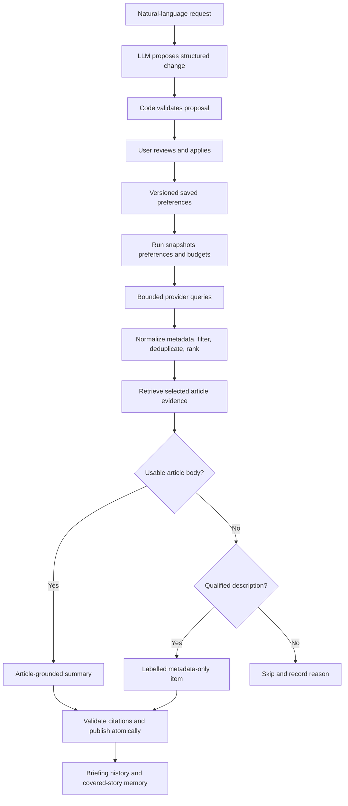

# Preferences, discovery, evidence, and stored memory

Last updated: 2026-09-19. This is the pipeline implementation reference and
the project's sole actionable improvement backlog. **Current** means implemented
code; **planned** means the agreed design; **proposed default** means a
reviewable choice not yet shipped. Every open follow-up has one ID in the
Improvement backlog table; other documents link to those IDs instead of
maintaining a separate TODO list.

## 1. Implementation status

| Area                                          | Current status                                                                                                                      |
| --------------------------------------------- | ----------------------------------------------------------------------------------------------------------------------------------- |
| Natural-language topic proposals              | Llama 3.3 70B proposal/review/Apply flow implemented; one live end-to-end smoke path passed                                         |
| SQLite preferences and proposals              | Durable Object SQLite preferences and pending/applied/discarded proposal records                                                    |
| Briefing publication foundation               | Versioned run/publication records and read interfaces; no generated briefing                                                        |
| Run-scoped collection and evidence            | Configured SearXNG plus Google News/GDELT bounded collection, temporary evidence, exact URL dedupe, and contained provider failures |
| Google News RSS and GDELT discovery           | Worker providers with fixture tests; recent live GDELT requests returned 429                                                        |
| SearXNG                                       | Private Cloudflare Container configuration, local container, bounded Worker provider, and responsive inspection screen              |
| Publisher evidence                            | Bounded Worker HTML extraction and separate local paragraph experiment                                                              |
| Description/snippet preservation and fallback | SearXNG provenance and inspection qualification implemented; composition planned                                                    |
| Ranking, grouping, briefing generation, chat  | Not implemented                                                                                                                     |

The feasibility endpoint returns diagnostics, not briefings. Preferences, topic
proposals, and immutable published briefing payloads are persisted. While a
briefing run is active, its candidate metadata, extraction output, and partial
collection failures are persisted temporarily for composition or retry; the
candidate evidence is removed on publication or run failure. Stories and
article bodies are never copied into a published briefing, and conversations
are not implemented.
No code currently creates a briefing publication.
SearXNG's container cache and ignored secret are infrastructure, not app memory.

## 2. End-to-end design



Code owns validation, budgets, fetching, URLs, dates, scheduling, exact
duplicates, storage, retries, and publication. The LLM interprets intent,
proposes search concepts, assesses semantic relevance, groups related stories,
compares developments, and writes grounded summaries. Model judgment cannot
override exclusions, evidence limits, or the preference Apply requirement.

## 3. Natural-language parsing — planned

### Topic-first configuration

Users add topics independently from the Topics screen rather than having to
write one prompt describing the whole daily briefing. Each topic has a stable
ID, name, enabled state, interests/exclusions, source preferences, summary
overrides, and its own search concepts. Global settings hold the daily
schedule, overall reading budget, and inherited summary defaults.

Adding a topic appends it; editing or pausing a topic changes only that topic.
Existing topics and global settings remain intact. A run snapshots all enabled
topics and combines their eligible stories into one briefing, applying a
single overall reading budget rather than granting each topic five minutes.
Cross-topic duplicate stories become one item with multiple topic references.

Build this incrementally: first explicit topic fields and add/edit/pause/delete
controls with persistence; then natural-language interpretation for individual
topics, using the same proposal/Apply flow. Natural-language changes to global
settings are a separate scope. A single all-in-one prompt may be an optional
later convenience, but is not the required configuration path. A topic prompt
that requests global changes must surface those separately, not silently apply
them outside the selected topic.

### Example topic input

> Follow AI model releases and practical developer tools, not stock prices or
> celebrity opinions. Prefer official releases. Use short technical bullets
> explaining what happened and why it matters.

This creates or edits only the AI topic. World news and Liverpool are separate
topics added independently. The five-minute reading budget and 08:00
Asia/Kolkata schedule come from global settings. The topic description is a
preference request, not a literal search query.

### Interpretation, validation, and Apply

1. Validate the request size and operation at the API edge. Load the current
   preference revision and explicit scope: add topic, edit a specific topic,
   or edit global settings.
2. Give the model the request, current topic (including `userWording`), current
   settings, supported fields, and output schema. Require a complete proposed
   topic whose non-empty narrative consolidates prior intent with the new
   request, an explanation, and unresolved questions. Reject an unchanged
   narrative for a non-empty edit request. Do not run searches or write SQL from
   model output.
3. Validate the output with Zod and deterministic semantic checks: schedule,
   IANA timezone, lengths, topic IDs, provider IDs, source URLs, and bounded
   search concepts. Schema validation checks shape, not interpretation quality.
4. Show a before/after proposal. Missing fields mean unchanged; clearing a
   field must be explicit. Unrelated topics must not silently reset.
5. Ambiguity remains unapplied until clarified or edited. “Skip Liverpool
   today” requires distinguishing a run override from a saved exclusion.
6. Apply only on explicit user action. Check the proposal's base revision,
   reject stale updates, save atomically, and increment the preference revision.

“Make it shorter” should propose reading-length changes. A question about a
story must not mutate preferences. A rejected proposal changes nothing.

### Logical preference shape

Illustrative JSON, not an implemented schema:

```json
{
  "revision": 1,
  "schedule": { "localTime": "08:00", "timezone": "Asia/Kolkata" },
  "reading": { "targetMinutes": 5, "targetStories": { "min": 8, "max": 10 } },
  "summary": {
    "format": "bullets",
    "depth": "concise",
    "audience": "general",
    "emphasis": ["what happened", "why it matters"]
  },
  "exclusions": [],
  "sources": { "preferred": [], "blocked": [], "officialFirst": false },
  "topics": [
    {
      "id": "ai",
      "name": "Artificial intelligence",
      "enabled": true,
      "interests": ["model releases", "developer tools"],
      "exclusions": ["stock-price coverage", "celebrity opinions"],
      "sourceOverrides": { "officialFirst": true },
      "summaryOverrides": { "audience": "technical" },
      "searchConcepts": [
        { "terms": ["AI model", "release"], "intent": "new models" },
        { "terms": ["AI developer tools"], "intent": "practical tools" }
      ]
    }
  ]
}
```

The example abbreviates world-news and Liverpool topics; production proposals
need complete validated concepts for each active topic. Story count is a
target, not a quota. Effective summary settings merge global values with
explicit topic overrides; absent topic fields inherit global values.

Store relevant user wording alongside structured settings so requests such as
“focus on operational impact” survive a coarse style enum. Style instructions
control presentation but cannot authorize unsupported detail. “Detailed
technical analysis” must remain limited when only a description is available.

### Search concepts versus provider queries

The model proposes provider-neutral entities, aliases, required phrases,
exclusions, source preferences, language, and freshness. Code compiles these
into provider-specific requests and checks capabilities. A literal query does
not have identical semantics across providers.

For example, “Liverpool FC” plus football context disambiguates the city.
Store the applied search plan with its preference revision and record actual
queries per run. Reapply exclusions after discovery because provider filters
can be incomplete. Query counts, ranking weights, lookback, and failover order
still need evaluation rather than being fixed by this document.

## 4. What will be stored

The Agent owns Durable Object SQLite and explicit versioned migrations; the
Workflow owns generation steps. These are logical records, not a requirement
for a separate SQL table for every row.

| Record              | Stored fields                                                                                                                                      | Purpose and retention                                                     |
| ------------------- | -------------------------------------------------------------------------------------------------------------------------------------------------- | ------------------------------------------------------------------------- |
| Preferences         | Revision, global/topic settings, applied wording, search plan, updated time                                                                        | Editable persistent configuration                                         |
| Proposal            | Original request, base revision, validated patch, explanation, status, parser/model version                                                        | Review/apply audit; proposal retention still to decide                    |
| Conversation        | Message ID, role, text, timestamp, story/briefing references, citations                                                                            | Keep until deleted; do not store hidden model reasoning                   |
| Run                 | ID, trigger, preference snapshot/revision, queries, errors, timestamps, status, usage                                                              | Reproducibility and cost accounting; diagnostic retention still to decide |
| Source metadata     | Headline, original discovery URL, resolved publisher URL, source, topic, provider/engine/query attribution, dates/provenance, optional description | Lightweight source records referenced by saved items                      |
| Briefing            | Date, run ID, completeness, preference revision, ordered items, summaries, citations, evidence tiers, limitations                                  | Keep until deleted                                                        |
| Covered story       | Group ID, source URLs, last-covered time, previous factual development, evidence tier, fingerprint                                                 | Suppress repeats; expire after 90 days                                    |
| Evidence provenance | Retrieval time, final URL, extraction version, status/reason, truncation, evidence reference/hash                                                  | Audit summary support; a hash alone does not preserve evidence            |
| Temporary evidence  | Bounded extracted text, run association, expiry                                                                                                    | Retries/composition; exact TTL and cleanup mechanism still to decide      |

Do not permanently save publisher HTML or full article copies. Save composed
summaries and lightweight attributed descriptions. Any permanent supporting
excerpt retention needs an explicit decision; it is not currently agreed.

Runs need immutable preference snapshots and stable publication IDs. A unique
publication constraint must prevent duplicates after Workflow retries.
Workflow step results may retain temporary evidence; understand their platform
retention before claiming immediate deletion.

Deletion removes owned briefings/conversations and unreferenced source records.
Do not delete a source still referenced by another briefing. Memory deletion
and preference reset need explicit UI controls. Proposal and diagnostic
retention are open decisions rather than silently indefinite storage.

## 5. Discovery parsing

### Current normalized contract

`src/server/discovery/types.ts` currently contains:

| Field         | Meaning                                               |
| ------------- | ----------------------------------------------------- |
| `id`          | Provider-normalized URL used for exact deduplication  |
| `title`       | Provider headline                                     |
| `publisher`   | Google RSS source label or GDELT destination hostname |
| `publishedAt` | Parsed Google RSS date; null for GDELT                |
| `sourceUrl`   | Google redirect link or GDELT publisher link          |
| `discovery`   | `google-news` or `gdelt`                              |

SearXNG additionally preserves optional `description` (text, kind, provider,
observation time), `engines`, and `dateProvenance`. Shared runtime schemas live
in `src/shared/inspection.ts`; discovery reexports the types. Search responses
also retain query, observation time, and selected time range. The provider enum
includes `searxng`; its source URL is a direct publisher lead and publication
date is parsed search metadata or null. Google/GDELT contracts remain compatible.
There is no language, separate resolved publisher URL, or semantic group ID
on candidates yet; evidence returns its own final article URL. Exact URL deduplication does not
group independent coverage of the same event.

### Google News RSS — current

`discovery/google-news.ts` validates query length (2–200), locale/country
syntax, and result cap (1–25). It fetches RSS with a 10-second timeout and
streamed 750 KB bound. A regex parser reads title, link, source, and pubDate,
removes CDATA, and decodes a small set of XML entities. Only HTTPS Google News
links survive; `oc` and fragments are removed. Valid dates become ISO strings,
invalid dates become null. It deduplicates URLs and caps results.

It does not preserve `<description>`. A Google description may merely repeat
the title, link, and source; that does not qualify as an informative fallback.
Regex XML parsing and partial entity decoding are feasibility limitations.

Normal Google redirects currently do not resolve publisher pages. The separate
script decoded one through undocumented parameters and `batchexecute`; that
decoder is not in the Worker. See [link verification](discovery-link-verification.md).

### GDELT — current

`discovery/gdelt.ts` validates query length/result cap, appends an English
filter, and requests JSON article-list results for the past week sorted by
index date. It enforces a 10-second timeout and streamed 750 KB bound. It
requires JSON and an article array, then validates each record with Zod.
Nonempty titles, English records, and HTTP(S) links without credentials
survive. It removes fragments, deduplicates URLs, and derives publisher from
the hostname.

GDELT `seendate` is indexing time, not publication time; `publishedAt` stays
null. The adapter preserves no description. When one is absent, there is no
description fallback to create. Recent isolated live requests returned 429
despite long intervals; five-second spacing does not guarantee acceptance.

### SearXNG — current Worker integration

The Worker validates JSON results, sanitizes titles/snippets, rejects invalid
URLs, deduplicates exact URLs while merging engines, and preserves engine
failures. It uses news category, English, a 15-second timeout, streamed 750 KB
bound, and at most 15 candidates. Optional time filters are passed to engines;
they do not guarantee freshness. Missing/invalid dates stay null. Search never
automatically fetches article evidence. The local UI explicitly requests it.

Local evidence was available across all three topics, but searches included
old, blocked, and JavaScript-only results. An empty engine-error list does not
prove relevance or freshness. See [measured results](../infra/searxng/README.md).

### Planned metadata additions

Preserve the original discovery link separately from the resolved publisher
URL. Add an optional description object with bounded sanitized text, kind
(`publisher-feed`, `search-snippet`, or `publisher-metadata`), source URL,
provider/engine, and observation time. Do not replace missing descriptions with
model-generated text.

Keep indexed/discovered times distinct from publication time. Add language,
date provenance, provider/query attribution, and a many-to-one mapping into
semantic groups. URL normalization must preserve article-identifying query
parameters. Grouped sources keep their own citations; do not merge snippets
into a fictional single article.

## 6. Evidence parsing and limitations

### Current Worker

`src/server/evidence.ts` fetches direct publisher links independently of provider after URL checks. Google
links first require a publisher redirect; another Google link returns
unavailable. Publisher fetching follows at most five redirects, validates
each destination, and has a 10-second timeout.

Require successful HTML, stream-limit HTML to 500 KB, prefer an article block
or substantial paragraphs within main/document, sanitize entities/tags, reject
recognized challenge titles, and require 400 text characters. Return
at most 12,000 characters, final URL, truncation, and `publisher-page`
provenance, or an unavailable reason.

Body-read errors return unavailable. Results include page title and extraction
method. Literal private/reserved IPv4, IPv6, credentials, and local hostnames
are rejected; DNS-aware host policy remains pending. This is local-only inspection.

`usable` currently means a mechanical text threshold passed. It does not prove
article-body quality, completeness, trustworthiness, freshness, or support for
every follow-up. Navigation and consent text may pass the same threshold.

### Standalone local script

`verify-searxng-evidence.mjs` uses a separate paragraph heuristic: prefer an
`<article>` block, otherwise scan substantial `<p>` text and print a sample for
manual review. It has streamed size bounds, bounded redirects, and a 15-second
article timeout. Its successful experiment is not proof of an implemented
extraction quality across publishers. The Worker now uses a similar bounded
heuristic, with its own fixture tests.

### Planned stronger quality gate

Separate retrieval status from evidence tier. Check final URL, headline/body
agreement, article-like paragraphs, language, dates when available, boilerplate,
challenge pages, and truncation. Use a tested readable-body extractor rather
than blanket tag stripping.

Later rendering is a bounded replaceable evidence adapter, not an unlimited
browser crawler or a paywall bypass. HTTP 200 without article content remains
unavailable. External content is untrusted data: embedded instructions must
never change preferences, request secrets, or trigger unrelated tools.

## 7. Description-only fallback — planned policy

When stronger article evidence cannot be obtained within budget and there are
not enough stronger relevant stories, use a qualified concise description as a
clearly attributed limited item. Inspection implements tier qualification:
at least 80 characters, 12 words, and three distinct words beyond the title,
with common navigation/consent text rejected. This heuristic is not proof of
relevance or factual support. Briefing selection, exclusions, freshness policy,
fallback caps, and composition remain planned.

| Tier          | Material                                                                       | Allowed output                                                                |
| ------------- | ------------------------------------------------------------------------------ | ----------------------------------------------------------------------------- |
| Article       | Publisher body passes quality gate                                             | Grounded summary within supported detail                                      |
| Description   | Informative feed description, publisher metadata, or attributed search snippet | Short item explicitly labelled with origin and article limitation             |
| Headline only | Title, URL, source/date only                                                   | Optional discovery link outside the substantive briefing; no expanded summary |
| Unavailable   | Invalid links or no meaningful supporting material                             | Skip and record reason                                                        |

Search excerpts can be stale, truncated, or assembled from page fragments.
They have weaker provenance than publisher-authored descriptions. Keep their
origin visible; never present snippets as article text.

### Qualification and selection

1. Enforce relevance, exclusions, blocked sources, language, and freshness
   before fallback. Do not add weak stories to hit a target count.
2. Prefer stronger evidence within the same story group. Accessible coverage
   of the same event can replace a blocked article while keeping attribution.
3. Try bounded alternative candidates/providers before fallback. Do not let
   blocked pages monopolize the run or retry indefinitely.
4. Require informative description text beyond a repeated headline, publisher
   name, navigation, or HTML links. Sanitize and preserve its provenance.
5. Reject known-old descriptions for today's news. Unknown publication time
   stays unknown; eligibility for undated descriptions needs review.
6. Compose only what the description supports and cite its original source
   link. Prefer a resolved publisher link; a Google redirect can remain an
   explicitly identified discovery link. A publisher homepage is not an
   article citation.
7. Validate evidence tier, citation integrity, exclusions, and fallback count.
   Provider collection failures and item evidence limitations are separate
   dimensions; display both when applicable.

**Proposed initial tunables:** enable description fallback; allow up to two
items in a target 8–10 story briefing; limit each to one or two short sentences.
These values are not stored settings yet. Do not pad weak sections. If all
qualified items are metadata-only, present an explicitly limited update list
rather than claiming a normal full briefing.

### Example

Illustrative description: “Example Lab announced Model Q, adding a larger
context window. The release includes updated documentation.”

Allowed item: “Example Lab announced Model Q with a larger context window and
updated docs. **Description only — article text unavailable.** [Source]”

Do not add an exact context size, benchmarks, pricing, recommendations, or
deployment implications without evidence. A request for deep analysis does
not expand what a description supports.

### Chat and duplicate memory

Chat can use the saved summary/description and cite its origin. For deeper
questions, attempt bounded article retrieval again. If unavailable, explain
the limit; general model knowledge is not new article evidence. Freshly
retrieved content carries its own timestamp and citations and may differ from
the original briefing's source version.

Store metadata-only coverage in duplicate memory. A newly accessible article
with unchanged facts is not itself a substantial update. Resurface only a
supported factual development and explain what changed. Headline wording,
search rank, or snippet observation date is not enough. Sparse descriptions
may not support a reliable substantial-update comparison.

## 8. Failure, grounding, and cost controls

Use structured failure codes. A mixed run can have articles, description
fallbacks, and provider failures; publish those limits clearly. If no qualified
current items remain, preserve the previous dated briefing and record the
failed run. Never relabel old cached results as today's briefing.

Every stage needs request, byte, retry, model-input/output, and total-run
budgets. Respect provider throttling with bounded backoff and failover. Record
provider calls, model usage, and evidence/fallback counts before promising
monthly costs.

Validate model citations against supplied evidence IDs and reject unsupported
sources or detail. Schema checks do not prove factual grounding. Deterministic
interface tests and a separate live quality evaluation must both cover it.

## 9. Improvement backlog

Date-filter follow-up: local SearXNG now always queries all three engines
without native time filters, then filters normalized dates against inclusive
UTC ranges (24 hours / 31 days / 365 days) before applying the result cap.
Unknown/invalid and future dates are excluded only in filtered searches.
Diagnostics expose exact boundaries and exclusions. DISC-03 remains partial:
search dates are unverified and filtering cannot recover recent leads missing
from the returned candidate set.

Update this table with each related increment. Close items only against their
acceptance criteria. Priorities suggest sequencing; proceed one reviewed
increment at a time. Historical design sections above explain why an item
exists; they do not create additional work outside this table.

| ID        | Priority             | Status          | Work                                                           | Acceptance criteria                                                                                                                                        |
| --------- | -------------------- | --------------- | -------------------------------------------------------------- | ---------------------------------------------------------------------------------------------------------------------------------------------------------- |
| PREF-01   | Preference phase     | Awaiting review | Validated schema and proposal/Apply flow                       | Ambiguity stays unapplied; unrelated fields preserved; stale revisions rejected; rejection changes nothing                                                 |
| PREF-03   | Before topic prompts | Completed       | Independent persisted topic add/edit/pause/delete              | Add preserves existing topics; edit affects selected topic only; paused topics excluded from future run snapshots; one global reading budget               |
| PREF-02   | Preference phase     | Completed       | SQLite migrations and persistence                              | Reload/restart preserve preferences, schedule/timezone, and topic overrides                                                                                |
| DISC-01   | High                 | Completed       | SearXNG Worker provider                                        | Separate file; normalized links and attributed snippets; partial engine errors; local Worker integration passes                                            |
| DISC-02   | High                 | Partial         | Description/provenance fields                                  | Informative snippets preserved; headline-only RSS descriptions rejected; absent stays absent                                                               |
| DISC-03   | High                 | Planned         | Freshness and query quality                                    | Old geopolitics filtered; indexing never treated as publication; undated policy reviewed                                                                   |
| DISC-04   | Medium               | Partial         | Throttling and provider failover                               | Provider exceptions become partial failures; 429 cannot monopolize a run; concurrent calls respect budget; failures are retained                           |
| DISC-05   | Medium               | Planned         | Robust RSS/entity parsing                                      | CDATA, numeric entities, malformed XML, and empty feeds handled explicitly                                                                                 |
| DISC-06   | Deferred             | Planned         | Provider-side date filters                                     | Per-engine outgoing filters and returned dates are verified; unsupported ranges are explicit; measured freshness/coverage improves over Worker filtering   |
| DISC-07   | High                 | Planned         | Fair collection scheduler                                      | Every enabled topic receives a reserved pass; per-provider caps protect the shared remainder; configured SearXNG runs first                                |
| EVID-01   | High                 | Partial         | Readable-body and challenge detection                          | Navigation/consent fails; checked publisher fixtures extract matching article body                                                                         |
| EVID-02   | High                 | Completed       | Stream Worker bounds and contain read failures                 | Oversized chunked responses stop early; broken streams return unavailable                                                                                  |
| EVID-03   | High                 | Partial         | Reserved-address/redirect hardening                            | IPv4/IPv6 and credentials tested; DNS/host policy documented for Worker runtime                                                                            |
| EVID-04   | High                 | Partial         | Description fallback                                           | Strong same-story evidence wins; excluded/old/title-only stories rejected; labels/caps/grounded chat hold                                                  |
| EVID-05   | Later                | Deferred        | JavaScript rendering and evidence refresh                      | Quality gain measured against cost; no paywall bypass; provenance retained                                                                                 |
| BRIEF-01  | Briefing phase       | Planned         | Grounded composition, semantic groups, and substantial updates | Candidate-only model output materializes code-owned citations; groups/repeats are grounded; relevance rubric is evaluated; updates explain supported facts |
| BRIEF-02  | Briefing phase       | Planned         | Workflow atomic publication                                    | Stable snapshots; retries/concurrent launches cannot duplicate; total failure preserves prior date                                                         |
| STORE-01  | Persistence phase    | Decision needed | Proposal/diagnostic retention and evidence TTL                 | Explicit policies, Workflow retention understood, deletion cleans unreferenced owned data                                                                  |
| CHAT-01   | Chat phase           | Planned         | Persistent grounded follow-ups                                 | History survives restart; snippets never treated as full articles; citations open source links                                                             |
| DEPLOY-01 | Deployment phase     | Partial         | Private hosted SearXNG                                         | Private Container is configured without a public route; deployment validates image build, secret injection, engine coverage, and hosting-IP behavior       |
| DEPLOY-02 | Deployment phase     | Planned         | Cloudflare Access protection                                   | Settings, APIs, and Agent connections reject unauthenticated users and permit the configured single user only                                              |
| SCHED-01  | Deployment phase     | Planned         | Daily briefing scheduling and run status                       | 08:00 Asia/Kolkata runs handle manual/scheduled collisions, retries, partial failures, and timezone behavior                                               |
| EVAL-01   | High                 | Planned         | Fixtures plus live evaluation                                  | Three-topic relevance/freshness/evidence rates recorded, including failures and fallback grounding                                                         |
| COST-01   | Before production    | Planned         | Usage and configurable budgets                                 | One composition call/run and evidence/context caps hold; Cloudflare dashboard measurements support daily-workload estimates; no app telemetry is added     |
| UX-01     | Preference phase     | Planned         | Revise an ambiguous topic proposal                             | User can retain its selected topic and original request, answer clarification questions, and submit a new reviewable proposal                              |
| UX-02     | Preference phase     | Planned         | Refine topic-management UX                                     | Review real use of topic cards, inline details, and manual editing; reduce friction while retaining explicit review and safe destructive actions           |

### Integration progress against backlog

- DISC-01 and EVID-02: completed with Worker integration and interface tests.
- DISC-02: partial; SearXNG snippets/provenance preserved, RSS descriptions pending.
- DISC-04: partial; an unexpected provider exception now preserves results from
  other providers and queries. Provider-specific retry/backoff and fair
  scheduling remain open.
- DISC-07: planned by user decision. Current nested topic/query/provider loops
  can spend the shared query cap early. Replace them with reserved per-topic
  coverage, per-provider ceilings, and round-robin allocation. Configured
  SearXNG is the preferred collection provider; Google News and GDELT are
  bounded fallbacks.
- EVID-01: partial; article/paragraph heuristic and challenge detection added,
  but live EWTN extraction still included footer and related text.
- EVID-03: partial; literal-address guards strengthened, DNS policy pending.
- EVID-04: partial; inspection qualification and labels implemented, briefing
  eligibility, alternative coverage, caps, and grounded chat pending.
- EVAL-01: partial; live search yielded ten candidates for each topic. Checked
  AI EWTN (3,972 characters) and WFAE (5,471) passed mechanical extraction;
  AP failed with 403 and Miami Herald timed out. Liverpool evidence results
  are recorded in the next-iteration report. These samples are not coverage rates.

Open freshness, persistence, and briefing-fallback work is tracked by
DISC-03, STORE-01, and EVID-04 in the table above.
